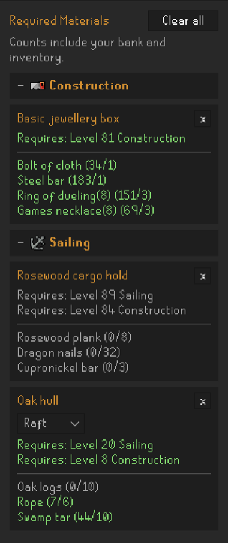
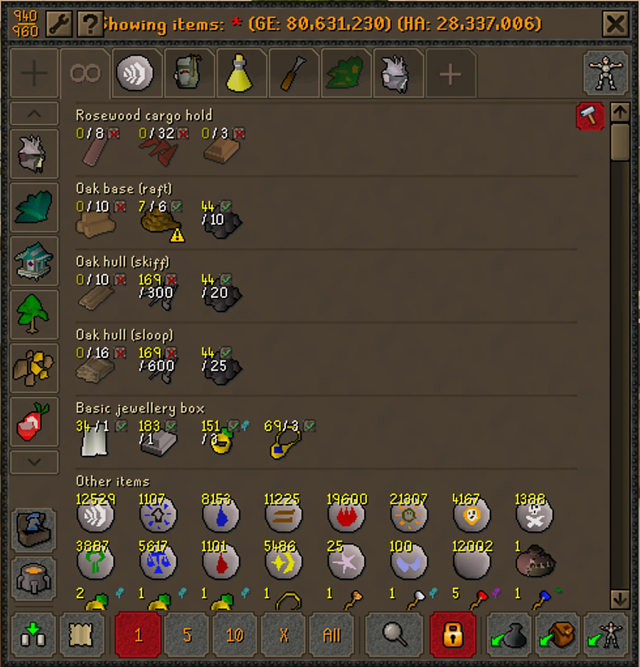

# Required Materials

Keeps track of what you still need to build things in **Sailing** and **Construction**.

Click something you want to build, and it gets added to a list showing exactly which materials
you're missing and which levels you need. Open your bank and one click pulls those materials to
the top, so you can see at a glance what to withdraw and what's still missing.

No setup, no configuration. Click a build, and it's tracked.

## Adding something to your list

Click on anything you want to build. It works in four places:

| Where | What to click |
|---|---|
| Sailing skill guide | any entry |
| Construction skill guide | any entry |
| Boat Customisation | **Build** or **Check Materials** |
| Furniture Creation menu | **Build** |

Both the old and new skill guide styles work. Clicking something already on your list just
refreshes it.

## Reading your list

The plugin checks your bank and inventory against what each build needs, and shows you what's
still missing.



Green means you have enough, orange means partway, grey means none yet — for levels as well as
materials. Boats come in three sizes, so those share one entry with a dropdown.

## Using it at the bank

Open your bank and you'll see a hammer button near the scrollbar. Click it:



These are your real bank items, just rearranged, so you can withdraw as normal. Click the
button again and your bank goes back to exactly how it was.

## Where the numbers come from

Requirements are looked up from the [OSRS Wiki](https://oldschool.runescape.wiki), so they stay
correct as the game changes without the plugin needing an update. Only the name of the thing
you clicked is ever sent, and nothing about you or your account leaves the game.

A handful of Construction activities aren't listed on the wiki in a way that can be read
automatically — Mahogany Homes, bird houses, STASH units and the eternal fires. Those are read
from the game itself instead, so they still work.

## Installing

Build it:

```bash
gradle jar
```

Then copy it into RuneLite's plugin folder:

```bash
mkdir -p ~/.runelite/sideloaded-plugins && cp build/libs/required-materials-1.0.0.jar ~/.runelite/sideloaded-plugins/
```

Start RuneLite and turn on **Required Materials** in the plugin list.

## How to contribute

### Running it locally

```bash
gradle run
```

This launches the real RuneLite client in-process with the plugin already loaded, so you can
log in and test against your own account. It restores your usual profile and session the same
way the normal client does.

By default this runs on whatever JDK Gradle itself is using. RuneLite doesn't get along with
very new JDKs — on Java 26 the event bus fails to register subscribers — so if `gradle run`
misbehaves, point it at an older one without editing the build:

```bash
gradle run -PrunJdk=/path/to/jdk/bin/java
```

To avoid passing that every time, put it in a `gradle.properties` at the project root, which
is gitignored:

```
runJdk=/path/to/jdk/bin/java
```

The `--add-opens` flags in the `run` task mirror the official launcher's own. Without them,
event subscriber registration silently falls back to slower reflection and logs
`LambdaConversionException` warnings, so leave them in place if you change the JDK.

To restart after a code change, kill the running dev client and start it again — a plain
`SIGTERM` shuts it down cleanly:

```bash
pkill -f RequiredMaterialsPluginTest && gradle run
```

### How the code is laid out

| Class | Does what |
|---|---|
| `RequiredMaterialsPlugin` | Event handling; decides what got clicked and in which skill |
| `WikiRecipeService` | Fetches and parses `{{Recipe}}` templates, cached per page |
| `ChatMaterialsParser` | Fallback: materials from chat messages |
| `GuideLevelReader` | Fallback: levels from skill guide widgets |
| `MaterialsManager` | Stores tracked builds, resolves item IDs, persists to config |
| `RequiredMaterialsPanel` | The side panel |
| `BankGroupedView` | Rebuilds the bank grid |
| `BankButtonManager` | The bank toggle button |

### Things worth knowing before you change something

- **Client thread.** Most RuneLite `Client` calls assert they're on the client thread, and
  Swing listeners are not. Anything touching game state from a UI callback has to go through
  `ClientThread.invoke`. Wiki lookups come back on an HTTP thread and need the same treatment.
- **Widget IDs** come from `net.runelite.api.gameval.InterfaceID`, not the deprecated
  `WidgetID`.
- **Dynamic widget children.** Some interface text lives on dynamically-created children whose
  `getId()` reports their static ancestor. The skill guide title is one of these — reading it
  directly always returns blank; you have to walk `getDynamicChildren()`.
- **Item IDs.** `ItemManager.search()` only covers GE-tradeable items, so non-tradeable
  materials fall back to a scan of the client's own item definitions. Anything that still
  doesn't resolve shows in red in the panel and can't be highlighted in the bank.
- **Wiki quirks.** An omitted `matNquantity` means 1, and a page with no recipe may be a
  disambiguation page whose first link is the real one.
